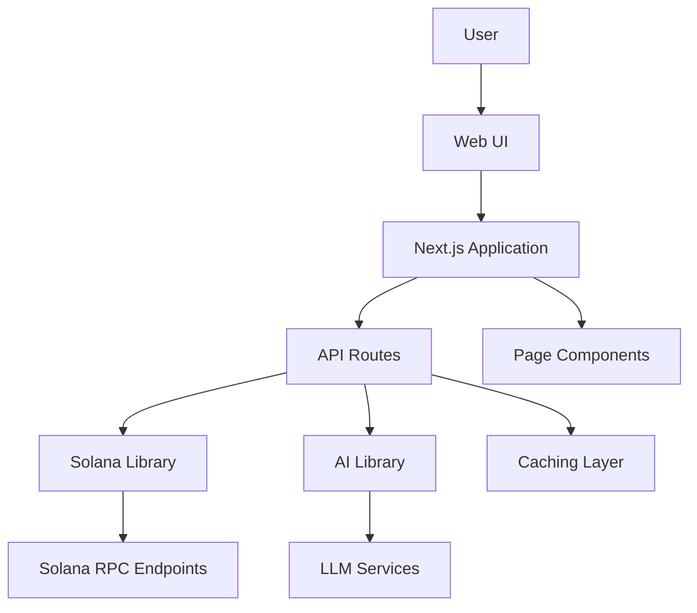
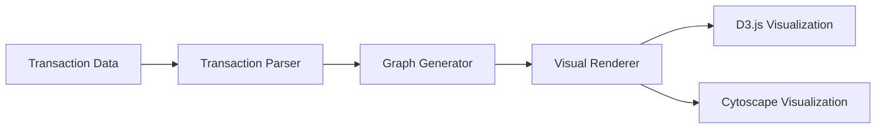
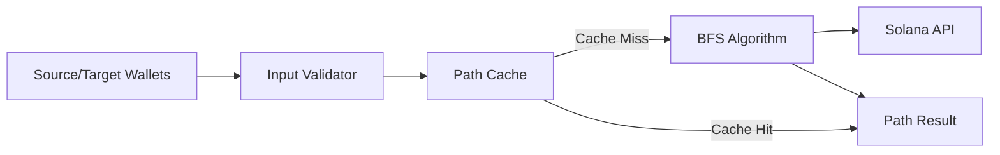
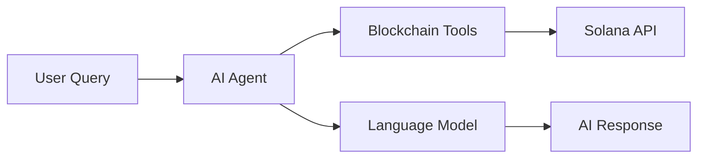
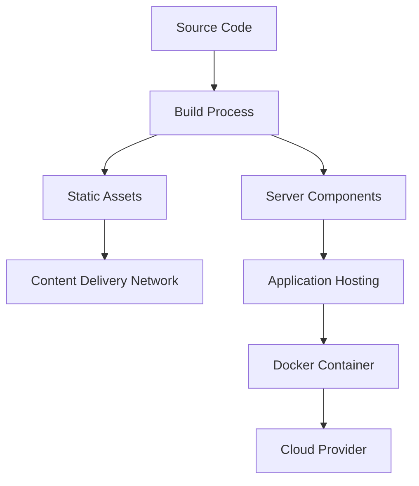

# OpenSVM Architecture

This document outlines the architecture of the OpenSVM project, describing its components, data flow, and technical design.

## System Overview

OpenSVM is built as a Next.js application with a client-server architecture. The application interacts with the Solana blockchain through RPC endpoints and provides a user interface for exploring blockchain data.

## Core Components

### Frontend Layer

- **Page Components**: React components for different views (blocks, transactions, accounts, etc.)
- **UI Components**: Reusable UI elements like tables, charts, and visualizations
- **State Management**: Client-side state management for UI interactions
- **Data Visualization**: Components for rendering blockchain data visually

### API Layer

- **API Routes**: Next.js API routes for handling data requests
- **Solana Proxy**: Middleware for Solana RPC requests
- **Data Processing**: Services for processing and transforming blockchain data
- **AI Integration**: Endpoints for AI-powered analysis and explanations

### Data Layer

- **Solana Connection**: Services for interacting with Solana RPC endpoints
- **Caching**: In-memory and persistent caching for performance optimization
- **Data Models**: TypeScript interfaces and classes for blockchain data

### AI Components

- **Agent System**: AI agent for handling natural language queries
- **Tools**: Specialized tools for different blockchain operations
- **Knowledge Base**: Structured knowledge about Solana and blockchain concepts
- **LLM Integration**: Integration with language models for generating responses

## Data Flow

1. **User Request**: User interacts with the UI to request blockchain data
2. **API Processing**: Next.js API routes handle the request
3. **Solana Interaction**: Solana library fetches data from RPC endpoints
4. **Data Transformation**: Raw blockchain data is transformed into application models
5. **Rendering**: Processed data is rendered in the UI

## Key Technologies

- **Next.js**: React framework for server-rendered applications
- **TypeScript**: Typed JavaScript for better developer experience
- **Solana Web3.js**: Official Solana JavaScript SDK
- **Tailwind CSS**: Utility-first CSS framework
- **D3.js/Cytoscape**: Libraries for data visualization
- **XState**: State machine library for complex workflows
- **Together AI**: LLM provider for AI capabilities

## Subsystems

### Transaction Visualization

The transaction visualization system renders graphical representations of transaction data:

### Wallet Path Finding

The wallet path finding system traces connections between wallets:

### AI Assistant

The AI assistant system processes natural language queries:

## Deployment Architecture

OpenSVM can be deployed in various environments:

## Performance Considerations

- **Caching**: Extensive caching of blockchain data to reduce RPC calls
- **Pagination**: Paginated data loading for large datasets
- **Lazy Loading**: Deferred loading of non-critical components
- **Optimized Queries**: Efficient RPC queries to minimize data transfer
- **Edge Caching**: CDN caching for static assets and API responses

## Security Considerations

- **Input Validation**: Thorough validation of user inputs
- **Rate Limiting**: Protection against excessive API usage
- **Error Handling**: Graceful handling of errors and edge cases
- **Environment Variables**: Secure storage of sensitive configuration
- **Content Security Policy**: Protection against XSS and other attacks