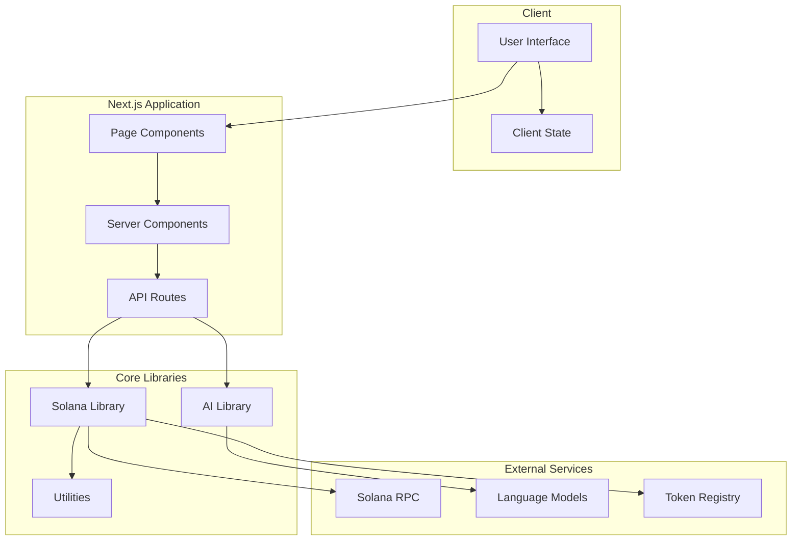
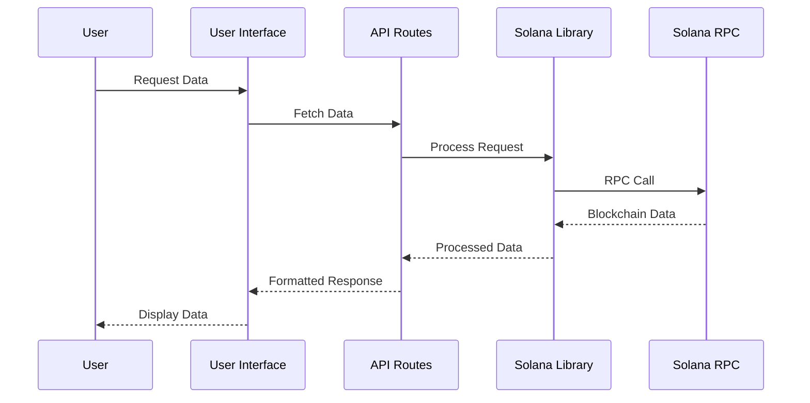
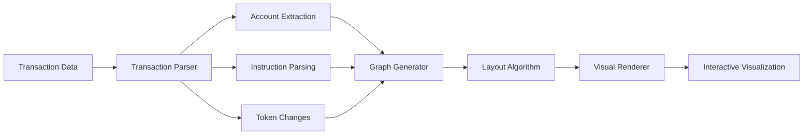
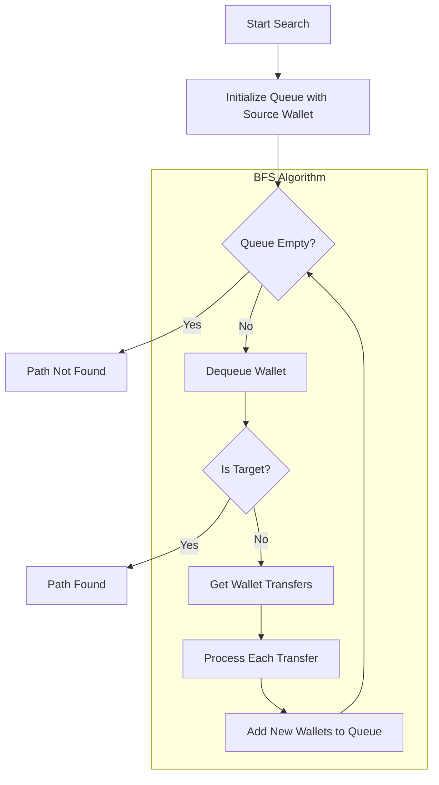
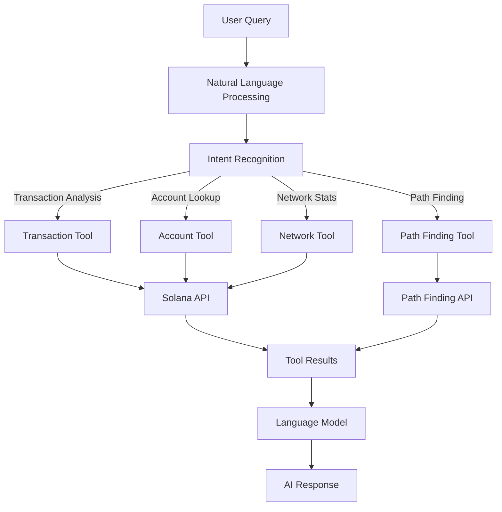
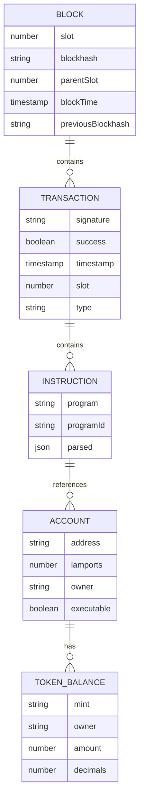
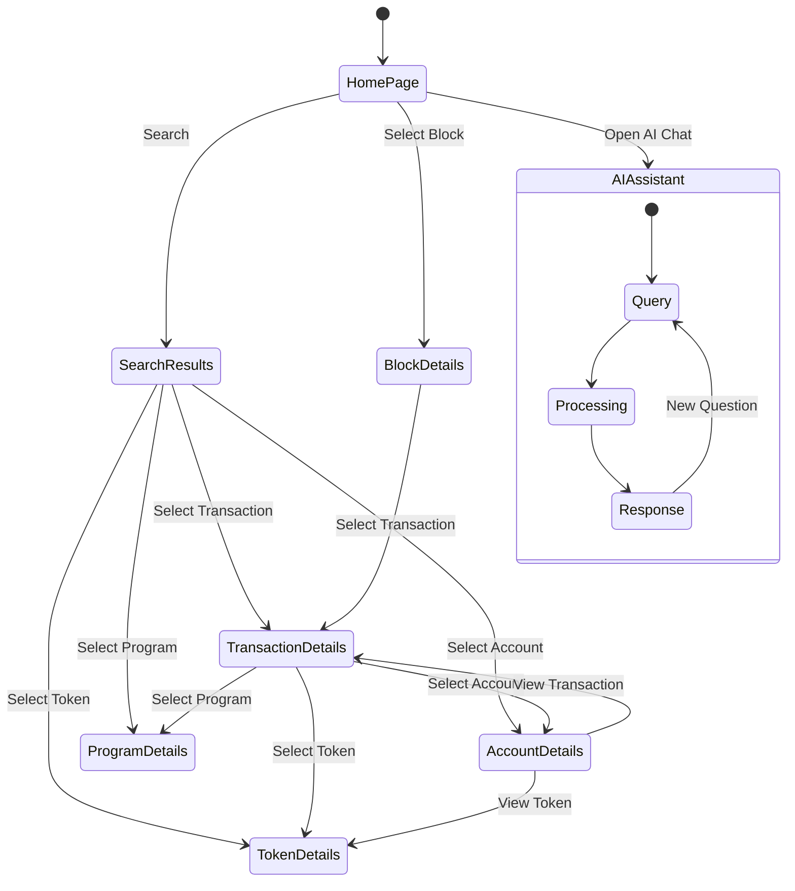
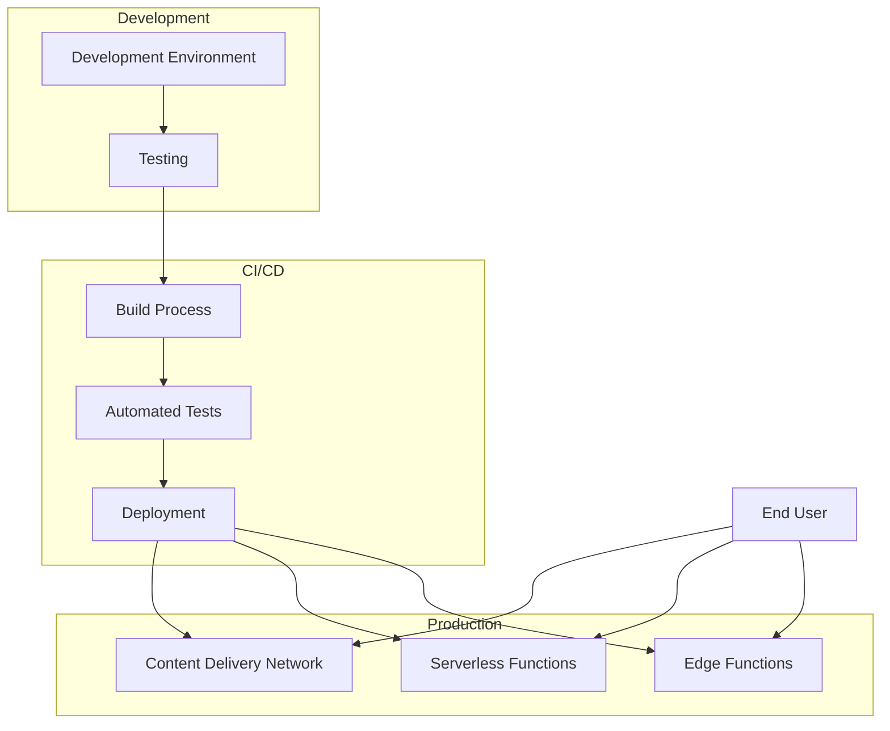
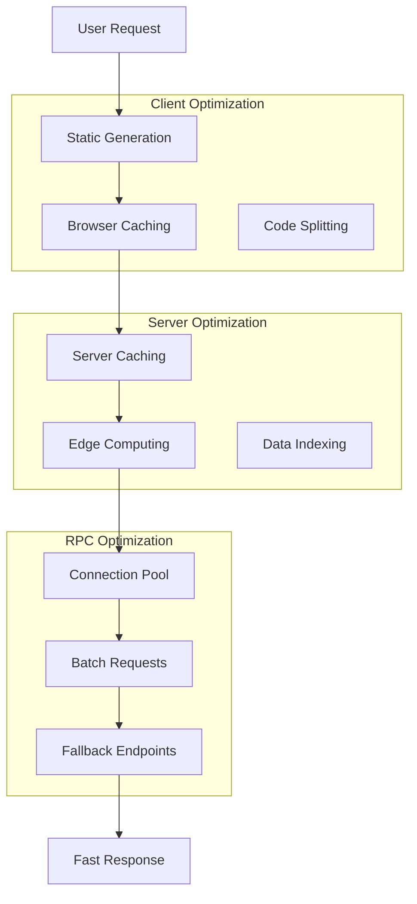
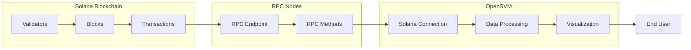

# OpenSVM Diagrams

This document contains diagrams that explain the architecture, data flow, and key features of the OpenSVM explorer.

## System Architecture

## Data Flow

## Transaction Visualization Process

## Wallet Path Finding Algorithm

## AI Assistant Architecture

## Block Explorer Data Model

## User Interaction Flow

## Deployment Architecture

## Performance Optimization Strategy

## Solana Data Flow

