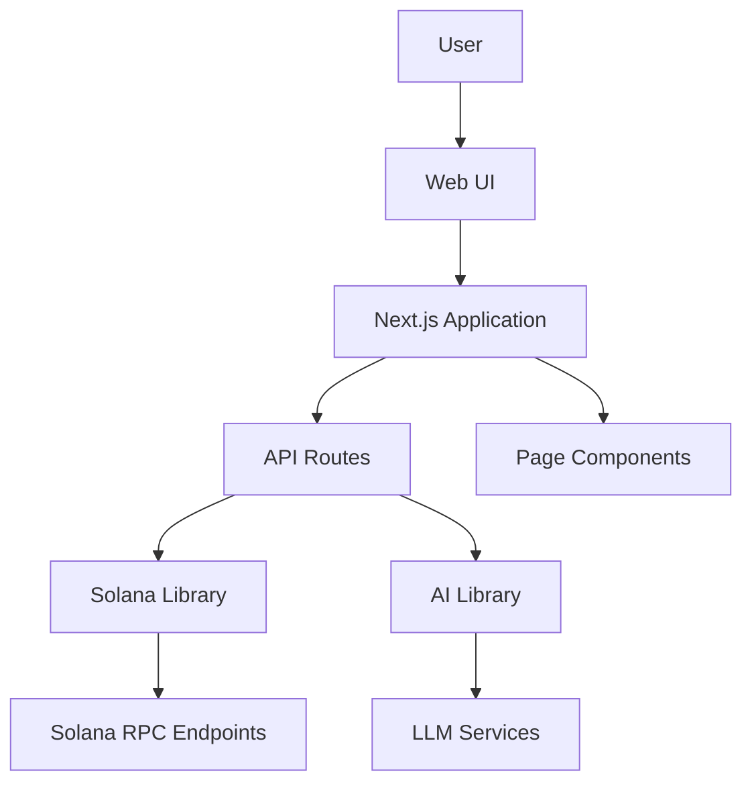

# OpenSVM Documentation

Welcome to the OpenSVM documentation. This guide provides comprehensive information about the OpenSVM Solana blockchain explorer.

## Overview

OpenSVM is a modern, feature-rich blockchain explorer for the Solana ecosystem. It provides detailed insights into transactions, blocks, accounts, programs, and tokens on the Solana blockchain, with advanced features like transaction visualization, wallet path finding, and AI-powered analysis.

## Documentation Sections

### Core Documentation

- [README](../README.md) - Project overview and getting started
- [Architecture](./ARCHITECTURE.md) - System architecture and components
- [Features](./FEATURES.md) - Detailed feature descriptions
- [API Reference](./API.md) - API endpoints and usage
- [Development Guide](./DEVELOPMENT.md) - Development setup and guidelines
- [Diagrams](./DIAGRAMS.md) - Visual explanations of architecture and workflows

### Feature-Specific Documentation

- [Wallet Path Finding](./wallet-path-finding.md) - Documentation for the wallet path finding feature

## Key Features

### Blockchain Data Browsing

OpenSVM provides comprehensive browsing capabilities for all Solana blockchain data:

- **Block Explorer**: View detailed information about blocks, including transactions, rewards, and program invocations
- **Transaction Explorer**: Analyze transaction details, instructions, and account changes
- **Account Explorer**: View account balances, token holdings, and transaction history
- **Program Explorer**: Explore program metadata, invocations, and accounts
- **Token Explorer**: Track token supply, holders, and transfers

### Advanced Features

OpenSVM includes several advanced features that set it apart from other blockchain explorers:

- **Transaction Visualization**: Interactive graphical representations of transaction flows
- **Wallet Path Finding**: Discover connections between wallets through token transfers
- **AI Assistant**: Get natural language explanations of blockchain data
- **Network Statistics**: Monitor Solana network performance and health

## Getting Started

To get started with OpenSVM:

1. Clone the repository: `git clone https://github.com/your-org/opensvm.git`
2. Install dependencies: `npm install` or `bun install`
3. Set up environment variables: Copy `.example.env` to `.env.local` and configure
4. Start the development server: `npm run dev` or `bun run dev`

For more detailed instructions, see the [Development Guide](./DEVELOPMENT.md).

## Architecture Overview

OpenSVM is built as a Next.js application with a client-server architecture:



For more details, see the [Architecture](./ARCHITECTURE.md) documentation.

## API Usage

OpenSVM provides a comprehensive API for accessing blockchain data programmatically:

```javascript
// Example: Fetch transaction details
const response = await fetch('/api/transaction?signature=your-tx-signature');
const data = await response.json();
console.log(data);
```

For complete API documentation, see the [API Reference](./API.md).

## Contributing

We welcome contributions to OpenSVM! To contribute:

1. Fork the repository
2. Create a feature branch
3. Implement your changes
4. Submit a pull request

For more details, see the [Development Guide](./DEVELOPMENT.md).