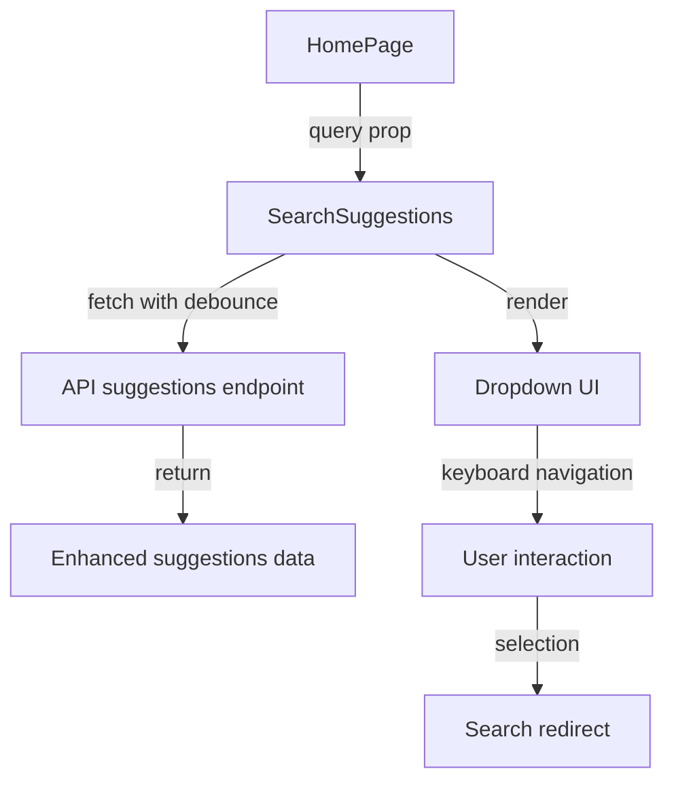

# Search Suggestions Implementation Plan

## Overview

This document outlines the plan for implementing a real-time search prediction dropdown for the search bar, including suggestions with entity type, last update date, actions count, and balance information.

## Component Architecture



## Data Model Enhancements

We need to extend the `SearchSuggestion` interface in `components/search/types.ts`:

```typescript
export interface SearchSuggestion {
  type: 'account' | 'transaction' | 'token' | 'program';
  value: string;
  label?: string;
  lastUpdate?: string;        // Last update date
  actionsCount?: number;      // Number of actions/transactions
  balance?: number;           // Current balance if applicable
}
```

## API Enhancement

We'll enhance the `/api/search/suggestions/route.ts` endpoint to provide additional metadata:

1. For transactions:
   - Add timestamp as lastUpdate
   - Extract balance information if available

2. For accounts:
   - Add recent activity timestamp as lastUpdate
   - Include transaction count as actionsCount
   - Add account balance

3. For tokens:
   - Include mint information
   - Add token supply or market data if available

4. For programs:
   - Show invocation count if available
   - Last invocation time

## SearchSuggestions Component

Create a new `SearchSuggestions.tsx` component that accepts just a query prop:

```typescript
interface SearchSuggestionsProps {
  query: string;
}

export const SearchSuggestions: React.FC<SearchSuggestionsProps> = ({ query }) => {
  // Implementation details here
}
```

Features to include:
- Debounced API requests (wait 300ms after typing stops)
- Loading state indicator
- Error handling
- Empty state handling
- Keyboard navigation (up/down arrow keys, Enter to select)
- Mouse hover interaction
- Clean visual presentation of entity type and metadata
- Auto-positioning dropdown below search input

## UI Design

The dropdown should follow this design pattern:

```
┌─────────────────────────────────┐
│ Search...                     🔍 │
└─────────────────────────────────┘
  ┌───────────────────────────────┐
  │ [TOKEN]  SOL                  │
  │ Balance: 1,234 • Updated: 1h  │
  ├───────────────────────────────┤
  │ [ACCOUNT] 8xDR4...J2xP        │
  │ Actions: 42 • Balance: 5.4    │
  ├───────────────────────────────┤
  │ [PROGRAM] spl-token           │
  │ Actions: 820 • Updated: 4m    │
  └───────────────────────────────┘
```

## Integration Steps

1. Fix the existing `app/page.tsx` integration:
   - Correct the input structure and onChange handler
   - Ensure proper positioning of the dropdown
   - Handle search form submission correctly

2. Add styles for the dropdown component:
   - Proper z-index to appear above other content
   - Shadow and border for clear visual separation
   - Smooth animations for appearance/disappearance
   - Responsive design considerations

## Implementation Notes

- Use a custom hook for suggestions fetching and state management
- Implement keyboard event listeners for navigation
- Add click-outside handling to dismiss the dropdown
- Ensure accessibility standards are met
- Add subtle animations for a polished feel
- Implement proper error boundaries